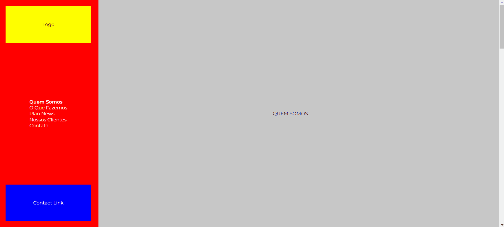

# Teste técnico - Grupo Plan Marketing

## Link
- Live Site URL: [https://teste-grupo-plan.vercel.app/](https://teste-grupo-plan.vercel.app/)

## Abrir no localHost
- O projeto foi construído utilizando a estrutura do Vite. Para abrir no localHost basta seguir os passos:
  - Clonar o repositório;
  - Abrir o terminar na pasta root;
  - Inserir os comandos 'npm install' e depois 'npm run dev';

## Técnologias utilizadas:
- Vite
- HTML
- CSS
- ReactJS
- Styled Components

## Meu processo
Antes de iniciar o projeto criei um cronograma para ordenar e organizar as ações, conforme imagem abaixo.

Assim dei prioridade para desenvolver a estrutura da página. 
Pensando em como o menu responsivo deveria funcionar, montei esse primeiro modelo abaixo:

Logo em seguida me preocupei em deixar funcionando a navegação para as seções, pois nunca tinha feito uma navegação nesse formato. Para essa funcionalidade utilizei a biblioteca 'React-scroll', que funcionou muito bem para o que eu precisava. 

Após a navegação estar funcionando comecei a trabalhar nos estilos.

## Desafios encontrados
Como as seções são mais horizontais na versão desktop, achei melhor utilizar o CSS grid na maioria dos layouts.

A transição do menu lateral para a versão mobile foi bem desafiadora. Acredito que poderia ter feito o código de alguma forma mais limpa, mas tendo em vista que o prazo estava apertado, achei que o resultado ficou satisfatório e funcional.

No arquivo do photoshop não estavam todas as seções do site, então tomei a liberdade de buscar a página original do Grupo Plan e usar como referência para essas partes faltantes.

Ainda gostaria de ter feito um slider no banner do topo da página, e inserido o reCAPTCHA no formulário. Como sabia que ia ficar um tempo pesquisando para fazer essas duas funcionalidade, pois ainda não as domino, achei melhor priorizar o restante para entragar a tempo.

## Conclusão
Achei o projeto bastante desafiador. Pude praticar bastante alguns conceitos importantes que já sabia e aprender alguns novos. Me sinto honrado em poder participar desse processo.

## Contato

- [Portfólio](https://www.alexandrefb.com)
- [Linkedin](https://www.linkedin.com/in/alexandre-fb/)
